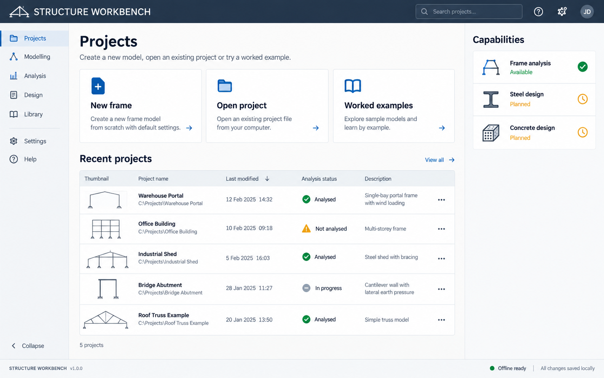
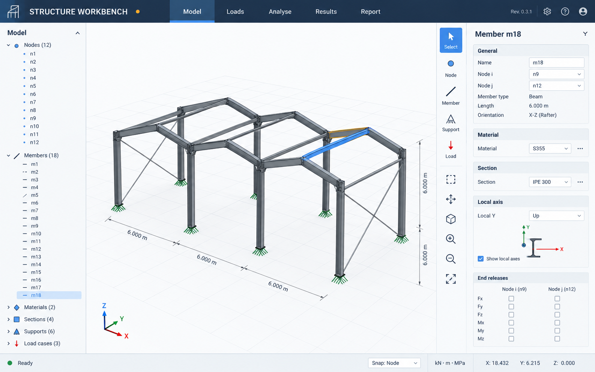
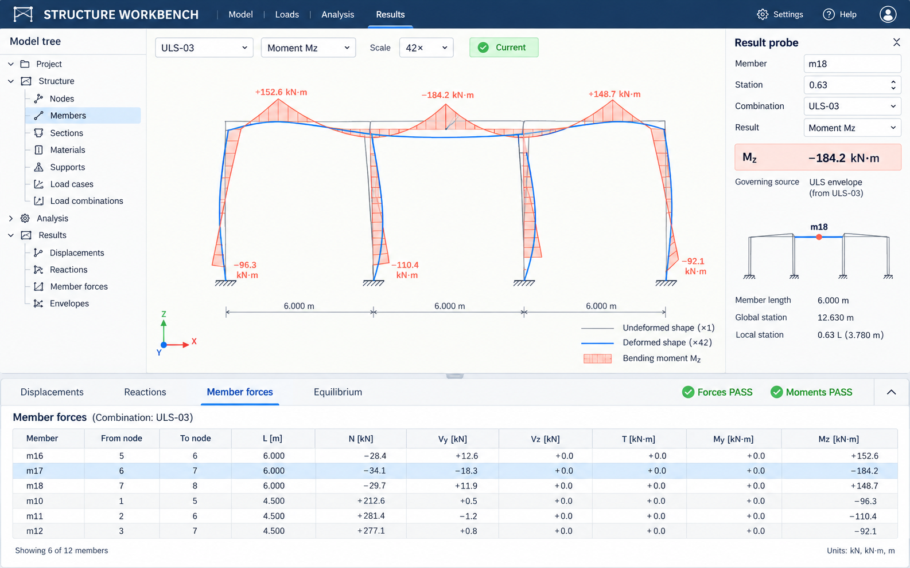
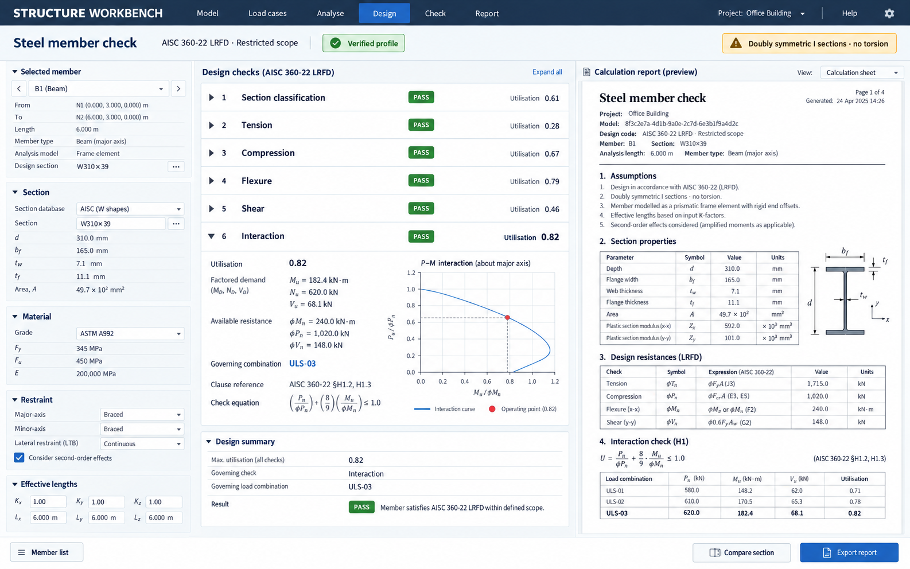

# Product screen designs

These high-fidelity concepts translate the specification into a consistent desktop product. They guide layout, hierarchy, workflows and visual language. They are not pixel-perfect acceptance references: implemented controls must use real data, accessible DOM elements and the behaviour defined by the specification.

## Shared visual system

- Dark navy application bar, warm white work surfaces and graphite engineering geometry.
- Engineering blue for selection and primary actions, amber for warnings and scope limits, green only for verified or current states, and coral for force diagrams.
- Compact system typography with tabular numerals. Minimum control text is 14 CSS px at the target desktop layout.
- Stable left navigation or model tree, central work surface, contextual right inspector and a resizable results drawer where needed.
- Icons always have labels or accessible names. Colour never carries status alone.
- Dense data remain readable through alignment, grouping and whitespace rather than decorative cards.

## Screen 01 Projects

Supports first session, recovery and project discovery. The three primary actions map to new model, portable project import and validated examples. Capability states distinguish available modules from planned work. Recent projects expose analysis state and local persistence without implying cloud storage.

Implementation notes: populate recent projects from IndexedDB; keep Open project available after storage failure; show exact build and offline state; never hard-code capability status in display-only markup.

## Screen 02 Model workspace

The model tree, WebGPU viewport and property inspector remain synchronised by stable entity ID. The selected member shows section, material, local axis and releases. The viewport emphasises topology and structural meaning; editable properties remain standard accessible controls.

Implementation notes: preserve the specification's panel dimensions as initial targets; use authoritative Rust geometry for commit and picking; expose keyboard/table alternatives; distinguish selected, hovered and invalid entities; keep units and snap state visible.

## Screen 03 Analysis results

The viewport overlays deformed geometry and a signed bending-moment diagram while the probe gives entity, station, combination, value and governing source. The results drawer provides exact tabular values. Current/stale state and equilibrium checks are always visible.

Implementation notes: derive plots and tables from the same immutable result buffers; retain discontinuity sides and exact extrema; do not mix envelope maxima into a simultaneous force vector; a failed analysis shows structured diagnostics instead of a result screen with zeros.

## Screen 04 Steel member check

The design screen combines input provenance, a mandatory-check tree, governing utilisation and calculation report. The verified-profile badge is scoped by the adjacent edition and limitation notice. Users can inspect each check rather than accepting a single traffic-light result.

Implementation notes: render this screen only for an enabled, verified code profile; an unsupported mandatory check changes overall status to unsupported; link demand to one real model hash, result set, station and combination; preserve exact clause and intermediate-value traceability in the export.

## Responsive and degraded behaviour

The full CAD workspace targets 1280 by 720 or larger. At narrower widths, the tree and inspector become mutually exclusive overlays while save, analysis state, results tables and export remain accessible. If WebGPU is unavailable, retain modelling forms, tables, calculation results and portable project export with a clear viewport capability message.

## Relationship to milestones

| Screen | Primary milestones |
| --- | --- |
| Projects | M00, M04, M05 |
| Model workspace | M00–M03 |
| Analysis results | M00–M06 |
| Steel member check | M07 |

The images contain illustrative project names and values. Acceptance comes from the contracts and validation corpus, not from reproducing those values or pixels.
