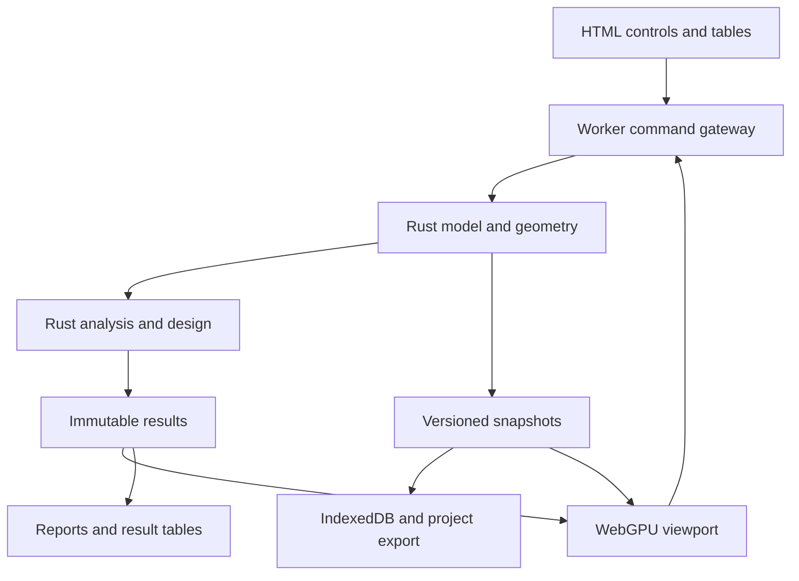

# Browser structural engineering workbench specification

Version 1.0 • Research baseline 19 September 2026 • Status proposed implementation contract

This specification defines an independently implemented, PROKON inspired structural modelling, analysis and design workbench. Its kernel is Rust compiled to WebAssembly. Its CAD viewport uses WebGPU. Its browser interface is plain HTML, JavaScript ES modules and CSS. The implementation is intended for AI agents working with little routine human involvement.

The recommended first release is a complete, local frame-analysis product: create a structure, assign properties and loads, solve it, inspect forces and deflections, compare alternatives, export a reproducible report, and reopen the project. Material design, advanced finite elements and detailing follow as independently usable vertical slices. Full PROKON parity is a long-term portfolio, not an MVP acceptance condition.

This is a delivery specification, not a working implementation or a certification of structural calculations. Included numerical fixtures are original analytical acceptance seeds. No PROKON executable, proprietary file format, private section database, licensed standard text or observed PROKON numerical output was supplied. No numerical parity with PROKON has yet been demonstrated.

## 1 How agents must use this package

Read this document, AGENT_RUNBOOK.md, VALIDATION.md and SOURCES.md before implementation. Use contracts/project.schema.json for the initial project format, fixtures/benchmarks.json for analytical truth, roadmap.json for dependency order, and agent-tasks for the first executable assignment. README.md indexes every deliverable. The package self-check validates this handoff; it does not validate a future structural solver.

Normative language: MUST is a release gate; SHOULD is a default that can change with a recorded architecture decision and equivalent evidence; MAY is optional. Priority order is user requirements, this specification, its machine-readable contracts, then implementation convenience. If a schema contradicts prose, fail the affected task and produce a minimal contract correction with regression evidence; do not silently choose the easier interpretation.

All estimates are planning ranges, not promised completion dates. All platform and performance figures below are product targets, not measurements. The research date is a catalogue baseline; agents must pin dependency versions and actual browser builds during M00.

## 2 Decisions and assumptions

| Decision | Required default | Why and change condition |
| --- | --- | --- |
| Product identity | Working title Structural Workbench | Functional inspiration; original interface, implementation, examples and branding |
| Initial audience | Engineers and technically capable learners analysing small building frames | One complete workflow is testable before a full module suite |
| Runtime | Static HTTPS application; localhost for development | No server-side analysis; file double-click is not the supported launch path |
| Frontend | Native ES modules, DOM and CSS, JSDoc types | No React, Vue, Angular, TypeScript source requirement or frontend runtime framework |
| Authoritative data | Rust model and command reducer in a dedicated Worker | One source of truth for geometry, validation, units and analysis |
| Rendering | JavaScript WebGPU API and WGSL | Keeps DOM integration direct; GPU is not the numerical authority |
| Numerical precision | Rust f64 for geometry, assembly, solve and design | GPU display data may be f32 only after origin rebasing |
| Initial model | Straight prismatic frame members; line geometry | No general BREP or solid CAD kernel needed for the MVP |
| Initial solver | Linear elastic small-displacement Euler Bernoulli 3D frame | Planar presets constrain unused DOFs explicitly |
| Initial units | Internal m, N, Pa, kg, s, rad; UI m, kN, MPa, mm | Units are converted once at input and once at presentation |
| Initial design basis | mechanics-v1, with no building-code compliance claim | Allows useful autonomous delivery without inventing a jurisdiction |
| First code package | Proposed AISC 360-22 LRFD restricted steel member checks | Exact implementation waits for authoritative clause and example resources; not a jurisdiction selection for a real project |
| Local data | IndexedDB transactional snapshots plus explicit project download | Browser persistence is not a substitute for a portable backup |
| Offline | Installable static cache after first successful load | No cloud account or collaboration requirement in MVP |
| Release | Automatic candidate builds and objective gates | Production hosting still follows the deployment environment's authority rules |

WebGPU depends on secure contexts and supported browser/adapter combinations. Detect capabilities rather than assuming a browser name is sufficient. The GPU can be unavailable even when the browser exposes the API. [MDN WebGPU API](https://developer.mozilla.org/en-US/docs/Web/API/WebGPU_API)

WGSL's concrete scalar floating types are not a portable f64 structural-solver substrate. The chosen CPU/WASM solve path avoids coupling engineering results to rendering precision. [WGSL specification](https://www.w3.org/TR/WGSL/)

### 2.1 MVP boundary

M00 through M06 form the analysis MVP. A user can author planar and spatial frames, use nodal and member loads, combine linear cases, inspect reactions and member diagrams, compute elastic stress screens, save, recover and export a calculation record. Hard supported bounds are 5,000 nodes, 10,000 frame members, 100 cases, 500 explicit combinations and 30,000 active DOFs, subject also to the memory guard. These are acceptance targets to be demonstrated, not guarantees at this stage. Design-code MVP is M07 and is a distinct release.

Excluded from the analysis MVP: shells, solids, arbitrary CAD solids, plasticity, second-order response, cable/tension-only members, soil contact, code-generated wind/seismic loads, code-certified member sizing, connections, reinforcement detailing, DWG/native PROKON formats, Revit plugins, live collaboration and mobile CAD editing. Exclusions must appear in capability metadata and import diagnostics, not disappear during conversion.

### 2.2 Autonomy boundary

Agents may scaffold, implement, test, refactor, create internal releases and retry reversible failures automatically in their authorised workspace. They must not reinterpret missing numerical evidence as a pass, fabricate design-standard clauses, buy resources, accept licences, change project jurisdiction or publish engineering approval signatures. If a required resource is inaccessible, the affected capability remains blocked and independent slices continue. Analysis MVP completion must not depend on licensing a design code.

Automated development and verification are achievable goals. Equivalence to a commercial solver and professional engineering acceptance need independent evidence. The roadmap encodes those evidence dependencies without a human review meeting at every milestone. A project can ship an analysis release while a code package remains disabled.

## 3 Research findings and the parity baseline

The current official product pages identify PROKON 5.3. Sumo advertises graphical modelling, automated meshing, frames with shell/solid analysis, linear and advanced static analysis, dynamic analysis, load combinations, design integration, reporting, scripting and drawing/BIM imports. This is the relevant analysis baseline, rather than the marketing label alone. [PROKON Sumo](https://prokon.com/sumo/)

The concrete product lists beams, columns, slabs, footings, pile caps, retaining walls, punching shear and crack-width tools. It also describes calculation reports, reinforcement scheduling, prestressing and long-term behaviour. [PROKON Concrete](https://prokon.com/concrete/)

The steel product lists member and connection tools, including struts, beam columns, plate girders, crane beams, base/end plates, bolts, welds, anchors, hollow sections and splices. It supports both model-derived and standalone inputs. [PROKON Steel](https://prokon.com/steel/)

The home page separately identifies composite, masonry, geotechnical, Probar detailing and Prodesk Revit exchange. These are confirmed product families; their full current module-level behaviour was not established in this research. The detailed family pages intermittently failed to load. [PROKON product overview](https://prokon.com/)

### 3.1 Interpretation

The transferable product advantage is an integrated model-to-analysis-to-design-to-report workflow with traceable handoffs. A web clone that draws members but cannot diagnose an unstable model or reproduce an exported result has not delivered that workflow. Conversely, matching the appearance of proprietary dialogs is neither necessary nor sufficient for functional parity.

Separate five meanings of parity:

1. Workflow coverage: the user completes the same engineering task end to end.
2. Numerical agreement: equivalent assumptions produce comparable responses and governing checks.
3. Code coverage: exact edition, annex, clauses, exclusions and checks match the advertised scope.
4. Exchange fidelity: semantic data survive import/export with explicit loss accounting.
5. Operational breadth: model size, performance, recoverability, reporting and automation meet declared targets.

Do not publish a single unqualified percentage. Use a matrix of module × operation × formulation × code edition × platform × evidence. Absence of a licensed PROKON comparison corpus means numerical equivalence is UNKNOWN, even if analytical benchmarks pass.

### 3.2 Current uncertainty register

| ID | Uncertainty | Default resolution |
| --- | --- | --- |
| U01 | User jurisdiction and desired first material code | Ship mechanics-v1; implement proposed AISC profile only behind its resource and validation gate |
| U02 | Exact PROKON settings and benchmark outputs | Build lawful original fixtures; later compare against a versioned licensed installation or supplied exports |
| U03 | Current timber/general/legacy module inventory | Record as discovery backlog; do not count as confirmed 5.3 coverage |
| U04 | Browser/GPU hardware available to delivery agents | Software-GPU tests for correctness plus a real-GPU release lane; label unmeasured platforms |
| U05 | Sparse library WASM compatibility and fill-in cost | Resolve in M00 using a pinned build and real sparse fixture; bounded fallback described in section 8 |
| U06 | Rights to standards, examples and section tables | Resource manifests with rights status; synthetic sections unblock analysis |
| U07 | Full advanced product-family detail | Inventory gate before each family implementation; module rows must have official source and validation corpus |

## 4 User experience and interaction design

### 4.1 Application structure

At 1440 × 900, provide a 48 px top bar, a 240 px model tree, a flexible central viewport, a 300 px property inspector and a resizable results drawer initially 240 px high. Minimum full CAD target is 1280 × 720. Below that, panels become overlays; tables, save and export remain usable. This is a layout specification, not a dependency on a component library.

The top bar provides Project, Model, Loads, Analyse, Results and Report actions; it always shows project name, save state and current revision. The model tree groups geometry, materials, sections, supports, load cases, combinations and results. Selecting an item synchronises the viewport, inspector and accessible table. Bottom status shows active units, working plane, snap mode and pointer coordinate. Selection is stable by ID, never by array offset.

Use a light neutral canvas, muted grid, dark members, blue active selection and an orange hover outline. Loads, supports and diagrams have distinguishable glyphs; colour is never the only signal. Use a system font at 14 px minimum for controls, tabular numerals for results and clear focus rings. WCAG 2.2 AA is a design target; verify keyboard workflows and automated accessibility scans, not just a colour check.

### 4.2 First session

Landing actions are New frame, Open project and Worked examples. New frame asks only for title, planar/spatial mode and display units. Geometry and load templates include a cantilever, simply supported beam and portal. A template loads editable physical data; it must not contain hard-coded output as if it had been solved. A persistent help panel explains assumptions, local axes and current exclusions.

A complete first-use script: choose cantilever → enter span 3 m → choose custom section with stated E and I → fix left end → apply downward 10 kN at right end → Analyse → inspect 45 mm deflection and 30 kN m support moment → change I → rerun → export report → reopen project. This is the M00 demo and stays a release regression.

### 4.3 CAD commands

Tools: Select, Node, Member, Support, Load, Move, Copy, Delete, Split, Merge, Measure, Fit, Pan, Orbit, Plan and Elevation. Build commands through a state machine: idle → collecting inputs → preview → committed or cancelled. Escape discards the preview. Enter commits complete numeric input. Every commit is atomic, undoable and serialisable. Multi-selection edits either succeed for every target or report a failure without partial edits.

Viewport gestures: left click selects; Shift toggles selection; left drag on blank space box-selects; middle drag pans; right drag or Alt+left drag orbits in 3D; wheel zooms towards the cursor. In 2D, orbit is disabled. Space temporarily pans; Home fits extents; Delete removes selected entities with a dependency preview; Ctrl/Cmd+Z and Shift+Ctrl/Cmd+Z undo/redo. Browser shortcuts are prevented only while the relevant canvas/input has focus. All actions have toolbar and keyboard-accessible table alternatives.

Snapping prioritises existing nodes, member endpoints, explicit intersections, midpoint, then grid. Candidate distance is within 8 CSS px; ties resolve by that priority, depth, then entity ID. Snap preview states which entity will be used. Screen snapping is not topology merging: geometry tolerance is separate. Intersecting drawn members do not automatically become connected. The Connect intersections command previews splits and the resulting topology before one atomic commit.

Physical members own persistent IDs; analytical child elements are regenerated deterministically from intersections, internal loads or mesh refinement. Store parent member ID and station intervals on every child. Default projection view must distinguish crossing unconnected members. A near-coincident node warning never silently changes connectivity.

### 4.4 Numerical entry

Fields accept a signed decimal or scientific number followed by an allowlisted unit, e.g. 250 mm, 10 kN, 2.1e5 MPa. No JavaScript eval or arbitrary expression execution. Bare numbers use the field's displayed unit. Errors remain next to the field. NaN, infinity, unknown units, dimension mismatch and overflow are rejected before commands mutate state.

### 4.5 Result experience

An immutable result set is tied to model hash, analysis settings hash and solver build. Geometry, section, restraint or load changes mark results stale immediately. Stale results may be inspected with an unavoidable banner and are excluded from current reports and design evaluation. Changing camera, selection or display units does not invalidate analysis.

Show undeformed and deformed overlays, a scale factor label, reaction arrows, N/Vy/Vz/T/My/Mz diagrams, displacement tables, member end actions and equilibrium diagnostics. A result probe shows member ID, station, case/combination, axis convention, value and unit. Diagrams include discontinuities and actual extrema, not only fixed sample points. Envelopes always carry the governing case/combination and station; simultaneous forces for a design check must come from one actual combination.

Failures are actionable: Unrestrained motion near node n7 about global Z; Zero-length member m12; Unsupported torsion release; Memory estimate exceeds project limit. Never substitute zeros for failed values. Failed, missing and unsupported results are represented by structured status, not by valid-looking numeric cells.

## 5 Architecture and module ownership

The Rust kernel has separate crates for model, geometry, units, frame-elements, assembly, solver, results, design-rules, exchange, wasm-api and a native validation CLI. An application-worker.js module instantiates WASM and owns the project. Frontend modules implement app state, command forms, rendering, selection, tables, persistence, reports and worker transport. Only immutable snapshots and rendering deltas cross the worker boundary.



JavaScript may format numbers and create view projections; it MUST NOT independently compute member stiffness, design utilisation, connectivity, load combinations or geometry commits. CPU hit-test acceleration can use a Rust geometry query with a camera ray. Preview-only screen geometry is allowed and is discarded on commit.

### 5.1 Repository contract

Required implementation paths: crates/{model,geometry,units,frame,assembly,solver,results,design,exchange,wasm-api,cli}; web/{index.html,styles.css,app.js,worker.js,render/,ui/,state/,reports/}; contracts/; fixtures/{analytical,oracle,invalid,performance,exchange}; tests/{e2e,visual,accessibility,security}; tools/; docs/{adr,formulations,code-profiles}; evidence/; Cargo.lock; rust-toolchain.toml; package-lock.json; package.json; release-manifest.json.

No runtime CDN dependencies or remote fonts. Npm is permitted for development, tests and packaging. Rust dependencies are permitted with pinned versions, compatible licences and a successful browser-target build. Local static hosting is an engineering convenience, not a server application requirement. Keep the production runtime ES modules inspectable and source maps in the evidence bundle.

### 5.2 Worker protocol

Every request includes protocolVersion, requestId, operation, expectedRevision and payload. Every response includes requestId, operation, status, revision, modelHash and either payload or structured diagnostics. Mutation requests with a stale expectedRevision fail with REVISION_CONFLICT. The initial project creation operation is the only mutation without an existing revision.

Operations: capabilities, createProject, importProject, applyCommand, undo, redo, validateModel, analyse, cancelAnalysis, getSnapshot, queryGeometry, getResults, exportProject and evaluateDesign. Requests are handled sequentially for mutation. Analysis runs on an immutable snapshot; edits may continue in a separate active state after M03, and completed output becomes stale if its hash no longer matches.

For a synchronous WASM solve inside a Worker, posting cancel cannot interrupt the blocking call. MVP cancellation terminates the analysis Worker and reinstantiates it from the last confirmed model snapshot; command ownership must survive in a separate model Worker by M03. M00 may use one Worker but disable editing during a solve and restore the snapshot on cancellation. Do not advertise cooperative cancellation until chunked or atomic polling is actually implemented.

Use Float64Array for numerical output, Uint32Array for index mappings and Float32Array only for render packets. Transfer owned ArrayBuffers; do not detach the only authoritative copy. Copy WASM memory-backed slices before asynchronous use and recreate typed views after memory growth. No shared-memory or cross-origin-isolation requirement for baseline operation.

### 5.3 Dependency decision

Start with serde/serde_json, wasm-bindgen and small nalgebra matrices for element operations; evaluate sprs plus sprs-ldl for sparse symmetric storage and factorisation. faer is an alternative behind the same solver trait if measured results justify it. Its default parallel features need explicit review for the browser target. Do not assume any candidate works in WASM until M00 compiles and solves its fixture there. [wasm-bindgen guide](https://rustwasm.github.io/docs/wasm-bindgen/), [nalgebra](https://docs.rs/nalgebra/latest/nalgebra/), [sprs](https://docs.rs/sprs/latest/sprs/), [sprs-ldl](https://docs.rs/sprs-ldl/latest/sprs_ldl/), [faer](https://docs.rs/faer/latest/faer/)

The wasm32-unknown-unknown target has platform limitations, including unavailable conventional operating-system facilities. Isolate filesystem, clock, random and threading adapters; the mathematical core must require none of them. [Rust target documentation](https://doc.rust-lang.org/rustc/platform-support/wasm32-unknown-unknown.html)

## 6 Model and data contracts

### 6.1 Project entities

The initial JSON schema in this package is normative for analysis MVP. Project fields include schemaVersion, id, name, revision, displayUnits, analysisMode, gravity, materials, sections, nodes, members, supports, loadCases, loads, combinations, analysisSettings and metadata. Results and view preferences are exported separately from the engineering model hash; a portable archive may later package them together.

IDs are unique stable ASCII strings within an entity kind. References must resolve. Deleting a node with attached members uses an explicit dependent-deletion command; direct data imports with dangling references fail. Reordering entity arrays must not change the canonical engineering hash. Names are labels, not identity.

Materials have E, nu and density. G is E/[2(1+nu)] for the isotropic MVP; E > 0, -1 < nu < 0.5 and density ≥ 0. Sections have A, Iy, Iz, J and extreme distances cy/cz; all positive. Iyz = 0 is implicit: imported non-principal-axis sections require transformation or rejection. User-defined section properties are labelled user supplied. J is a Saint Venant torsion constant, not automatically Iy+Iz.

Nodes carry global coordinates. Members reference two distinct nodes, one material, one section, a localY vector, and rotational release flags at each end. The vector specifies a direction to project normal to local x; it need not be unit length but must not be parallel to x. Only My/Mz releases are supported in the MVP; axial, shear and torsion releases are rejected. Supports carry a six-item constrained-DOF array and a six-item prescribed-displacement array; a nonzero prescribed value requires the corresponding constrained flag. Support springs are a later schema extension.

Loads are typed nodal six-vectors, uniform member force densities, concentrated member force/moment vectors at a station, or self weight. Each references one case. Member loads explicitly state global or local axes; station coordinates are fractions 0 to 1. Interior point loads create analytical breakpoints. All load components must be finite.

Combinations are flat case-ID/factor records with a label and purpose analysis, service or strength. They are user defined in MVP, with no code implication. Duplicate case terms are rejected instead of being silently summed. Nested combinations are prohibited in version 1. Factored combinations apply only to linear analyses; nonlinear future cases must be explicitly re-solved.

### 6.2 Axes and sign conventions

Global coordinates are right handed with Z upward. Node DOFs are [ux, uy, uz, rx, ry, rz], with rotations by the right-hand rule. A member's local x points from its start to end. Let e1 = (xj−xi)/L; e2 is the normalised projection of localY perpendicular to e1; e3 = e1 × e2. Reject a projected norm below 1e-8 times the input vector norm. A default UI localY is global Y unless |e1·Y| > 0.95, when it is global Z. Store the chosen vector so later edits do not cause arbitrary rolling.

Transformation R has rows e1, e2, e3. The 12 × 12 displacement transform T is block diagonal R for translations and rotations of both ends; dlocal = T dglobal; Kglobal = Tᵀ Klocal T. Include explicit sign-convention illustrations and tests in docs/formulations. The raw element end-action vector q = Klocal dlocal − feq is the set of forces applied by the nodes to the element, in the same 12-DOF order.

Diagram section actions are defined as the resultant acting on the positive-x cut face of the left segment. With a load density p and concentrated actions, section action s(x) = −q_start − integrated loads over the left segment, with moments computed about the cut, including lever arms. Axial positive indicates tension. Publish both raw nodal end actions and section actions; do not compare them without sign conversion.

### 6.3 Tolerances and topology

Use a default explicit-merge distance of 1e-6 m. Minimum member length is 1e-6 m. Coordinate magnitudes above 1e7 m or extents above 1e6 m are rejected in v1; large survey offsets within the allowed magnitude are preserved in f64 and rebased for rendering. Merge tolerance is not used as a blanket epsilon for numerical comparisons.

Near-coincident warnings use the merge distance but never mutate data. Merge preview lists impacted members, supports and loads; conflicting restraints or repeated loads are not silently resolved. A geometry command that would create a zero-length member fails atomically. Tests cover endpoint reversal, vertical members, crossings, duplicates and local-axis changes.

### 6.4 Hashing and migrations

Canonical engineering JSON sorts entity arrays by ID and object keys lexically, uses one deterministic finite-f64 serialiser, normalises negative zero and excludes name, revision, timestamps and view/display preferences. It includes every numerical entity, gravity, analysis mode and analysis setting. SHA-256 of UTF-8 canonical bytes is modelHash. Release evidence records hashAlgorithmVersion; schema changes may change it only through a tested migration.

A schema major version increase requires an explicit migration chain. Before migration, keep the original bytes. Unknown future major versions open only in a metadata/backup recovery mode. Never drop unknown engineering fields and proceed with analysis. Validate complete imports in a temporary model before replacing current state.

## 7 CAD rendering contract

Create one WebGPU device and main canvas context. Use indexed meshes or instanced prisms for members, instanced support/load glyphs and batched screen-width quads for lines. Thick-line appearance must not depend on implementation-specific line widths. Keep camera matrices and per-instance data in bounded buffers with explicit WGSL alignment. Use a depth buffer, opaque pass, result overlay pass, selection outline and text/DOM annotation layer. Canvas backing size tracks CSS size times devicePixelRatio, capped by adapter limits.

Rust outputs render packets containing render revision, entity mapping, rebasing origin, endpoints, section envelopes and glyph instances. The JavaScript renderer converts coordinates relative to a nearby f64 origin before f32 upload. GPU meshes approximate appearance; picking and engineering distances use the authoritative geometry.

For picking, render an r32uint ID attachment without MSAA, with 0 reserved for background, plus depth. Read only a small cursor region asynchronously with correct bytesPerRow alignment. Coalesce hover requests and reject results from a stale camera or render revision. CPU ray queries are the deterministic fallback and the snap authority. Tests check matching entity selection across GPU and CPU paths.

Device loss: preserve project and results, show a recoverable viewport state, request a new device at most once automatically, rebuild every GPU resource from CPU data and fit the prior camera. If no adapter returns, retain tables, analysis, project export and recovery actions. This is degraded mode, not a WebGL CAD substitute. No unsupported device may show a blank unexplained canvas.

Geometric rendering validation uses known camera matrices, projected endpoint coordinates, ID-buffer selections, clipping and depth-order tests. Screenshot comparisons are secondary and use a fixed browser/font/adapter baseline. Never make pixel identity across vendors a solver release requirement.

## 8 Structural analysis contract

### 8.1 Element formulation

Use a two-node, 12-DOF, prismatic Euler Bernoulli spatial frame, isotropic elastic material, small rotations, uncoupled principal bending axes and Saint Venant torsion. Axial stiffness uses EA/L, torsion GJ/L. For local-y displacement v and rotation rz, the [vi,rzi,vj,rzj] block is (E Iz/L³) times:

```
[ 12,   6L, -12,   6L ]
[ 6L, 4L², -6L, 2L² ]
[-12,  -6L,  12,  -6L ]
[ 6L, 2L², -6L, 4L² ]
```

For local-z displacement w and rotation ry, use E Iy and reverse rotational signs relative to the v/rz block, consistent with w′ = −ry. Derive and commit the complete 12 × 12 matrix, not just copied code. Unit tests prove symmetry, six free-element rigid-body modes, strain energy, endpoint reversal and arbitrary orientation.

Uniform local qy loads have consistent [vi,rzi,vj,rzj] equivalent actions [qL/2, qL²/12, qL/2, −qL²/12]. For qz, use the corresponding opposite ry signs. Uniform axial loads use qxL/2 at each end. Self-weight is density × A × gravity per metre, transformed into element axes exactly once. Multiple self-weight assignments in one case are rejected unless explicit factors resolve the duplication.

Point loads inside a physical member must introduce an analytical node at the exact station and retain the physical member mapping. Recover force jumps and both one-sided values. Do not approximate the location by the nearest output station.

### 8.2 Releases and restraints

Implement end bending releases by static condensation of both stiffness and equivalent load vector; recover eliminated rotations where meaningful. With retained a and released b DOFs: Kc = Kaa − Kab Kbb⁻¹ Kba and fc = fa − Kab Kbb⁻¹ fb. Do not form a general explicit inverse; solve the small block. Handle a singular released block as a modelling diagnostic. Tests include uniform member loading, so an implementation that condenses stiffness alone fails.

Enforce fixed and prescribed DOFs through exact partitioning: Kff uf = Ff − Kfc uc. Reactions are reconstructed from the unmodified global system. No penalty springs or added diagonal stiffness may conceal a mechanism. A free rotational DOF with mathematically zero stiffness and zero load can be excluded only with an explicit UNUSED_DOF diagnostic; if it is loaded, fail with UNRESTRAINED_DOF. A weak but nonzero DOF cannot be deleted as unused.

Planar XZ mode fixes uy, rx and rz at all nodes as explicit generated kinematic constraints; ux, uz and ry remain active. These constraints are recorded in the model and reports. They do not count as physical out-of-plane design bracing.

### 8.3 Assembly and solve

Assign DOFs in canonical entity-ID order. Assemble sorted sparse triplets, combine duplicates deterministically and convert to CSC. Use symmetric permutation/ordering supported by the chosen factorisation. Use diagonal equilibration before sparse LDLᵀ or Cholesky on stable linear systems. A nonpositive pivot, nonfinite value or failed residual is a failed solve. Do not use pseudoinversion to return displacements for a mechanism.

For a positive diagonal Kff, define Sii = 1/sqrt(Kii), Ks = S Kff S, Fs = S Ff; solve Ks y = Fs and uf = S y. The scaled diagonal is one. A pivot ratio below 1e-12 is a failure candidate requiring an ILL_CONDITIONED or UNSTABLE diagnostic and evidence; 1e-12 to 1e-9 raises a warning even when the residual passes. These are initial diagnostic policies, not mathematical condition-number guarantees. Record a reciprocal condition estimate where supported and validate challenging well-conditioned/unit-rescaled fixtures before adjusting policy.

Cache symbolic factorisation only when topology, releases and constrained DOFs match. Cache numeric factorisation only when every stiffness-affecting quantity matches. Solve load cases as multiple right-hand sides in bounded batches. Evaluate combinations algebraically from validated case results. Envelope each scalar response with a provenance record. A combination must never mix independent extrema into a synthetic simultaneous force vector.

Sparse factorisation must be functional in the first slice. A temporary dense fallback is allowed only for ≤ 300 free DOFs with a visible capability cap, never to pass the final 30,000-DOF target. If the sparse dependency cannot compile, M00 remains incomplete until an alternative passes; do not silently shrink the agreed final MVP.

### 8.4 Output recovery

Return displacements, physical-support reactions, generated-constraint reactions, local end actions, section result functions and warnings separately. Include forces at member ends, load discontinuities, analytical element boundaries and exact interior extrema. Sampled rendering polylines are derived from these functions. Deflection fields must include the load particular solution or sufficient validated refinement; cubic interpolation of only the end displacements is insufficient for an exactly loaded fixed-fixed beam.

For each case and combination, store external load totals and support reaction totals including moments about a recorded global origin. Run scaled free-DOF residual, global force balance and global moment balance. Residual policy, per-quantity tolerances and analytical fixtures are in VALIDATION.md.

### 8.5 Mechanics design screen

M06 provides an explicitly elastic section screen, not a code check. At principal-axis extreme corners evaluate longitudinal stress σ = N/A + My z/Iy − Mz y/Iz under the stated convention. Verify the sign against a positive-unit-action fixture. Report maximum compression/tension and stress divided by a user-specified comparison stress. A rectangular-section template can calculate A and Iy/Iz analytically; it must request a valid J or use a sourced rectangular torsion approximation with documented range.

Do not derive shear stress from V/A and call it code shear resistance. Do not imply this elastic stress screen checks local buckling, member buckling, lateral torsional buckling, interactions, connections or deflection limits. A user-defined service deflection limit is shown with the exact span and displacement reference used. Deformation relative to the support chord is distinct from absolute nodal displacement.

## 9 Design code packages

Design rules are pure Rust functions consuming validated actions, section properties, material data, restraint/effective-length data and a pinned profile. Each returns status pass, fail, unsupported or indeterminate, plus check ID, demand, resistance, utilisation, units, clause reference, formula identifier, assumptions and intermediate values. A report can say pass only when every mandatory check is applicable and passes. One unsupported mandatory check makes the overall member unsupported, not green.

A code profile includes standard identifier, edition, amendments, design method, annex/jurisdiction where applicable, material ranges, supported section classes, supported actions, source document hashes, clause map and validation dataset IDs. No unqualified Eurocode or AISC option is acceptable. Defaults from different editions must not mix. Code status is versioned independently of solver status.

M07's proposed scope is prismatic doubly symmetric steel members with supported section classes, clearly specified lateral restraint and user-specified effective lengths. Deliver member tension, compression, flexure, shear and axial/flexural interaction only after applicable instability and section-classification checks are covered. If only a continuously restrained beam is validated, advertise precisely that smaller module; the broader M07 remains incomplete. Torsion, non-prismatic sections and unsupported shapes reject rather than approximate.

M08 introduces a rectangular reinforced-concrete beam use case. Required checks include flexure, shear, minimum/maximum reinforcement, anchorage applicability, spacing/cover and declared serviceability coverage. No code-neutral flexural formula can stand in for a verified concrete-code module. Source resource bundles are external dependencies, listed in SOURCES.md.

The Eurocode transition makes edition pinning particularly important: JRC describes the second-generation publication and withdrawal programme and national-annex work. This specification does not infer which edition governs an individual project. [JRC second-generation Eurocodes](https://eurocodes.jrc.ec.europa.eu/second-generation-eurocodes)

### 9.1 Optimisation

Only enumerate permitted catalogue sections or reinforcement arrangements under validated rules. Return the first feasible candidate under a stated objective such as mass, with all controlling checks. A deterministic tie-break uses catalogue ID. Always rerun full analysis when stiffness changes can redistribute actions. Stop after a configured candidate count and return incomplete search, not optimum. Never use an LLM to produce a numerical resistance or select an unchecked candidate at runtime.

## 10 Persistence, exchange and reports

### 10.1 Local durability

IndexedDB stores project snapshots, revision log, user preferences and cached result metadata. Commit a project snapshot and its current-pointer update in one transaction. Autosave within 1 second after a command acknowledgement, show Saving/Saved/Save failed, and retain the preceding ten confirmed snapshots subject to quota. Editing is not blocked by saving; export must remain available after quota failure.

Browser-managed storage can be evicted and quotas vary. Request persistence where supported, check estimated storage and provide explicit project downloads. Do not claim lossless survival of browser data clearing. [MDN storage quotas and eviction](https://developer.mozilla.org/en-US/docs/Web/API/Storage_API/Storage_quotas_and_eviction_criteria)

Use a single-writer lease with cross-tab notification; a second tab opens read-only until it explicitly takes the lease after checking the current revision. Recovery after Worker or tab failure restores the latest committed snapshot and reports unsaved changes, if any. A service worker updates assets atomically by build ID; do not mix an old WASM binary with new protocol code. Prompt to reload after saving when an update is ready.

### 10.2 Exchange

MVP import/export is schema-versioned JSON and result CSV. Export must be fully usable without the browser database. All numeric CSV columns include unit metadata. Text cells that begin with spreadsheet formula characters are escaped. Downloaded reports escape all names and other user-controlled content.

Later DXF is a restricted geometry exchange: lines/polylines on named layers, units, origin and optional node labels. Drawings are not automatically analytical connectivity. Unsupported entities produce a loss report. DWG requires an explicitly available lawful converter and remains separate from DXF. IFC requires an exchange profile, mapped object types and units; visually showing IFC geometry is not proof of analytical-model equivalence. Native Revit bidirectional parity is not fully achievable in a browser-only process; a future external adapter is a separate deployment product, while file-based exchange remains the browser-only alternative.

### 10.3 Calculation record

Generate a standalone downloadable HTML calculation report with print CSS. Browser printing can create PDF; a built-in PDF generator is not required for the MVP. The report embeds all needed styles and vector/static plots, works offline and includes title, project hash, date, application/solver build, formulation, units, model summary, assumptions, load cases, combinations, warnings, displacement/reaction/member results, equilibrium checks and excluded capabilities. Design sections additionally include profile, clauses, governing actions and intermediate checks.

Reports must not label a stale or failed analysis as current. Large reports may use selected cases and members, but the selection and omitted result counts must be explicit. CSV and project JSON remain complete exports within documented limits. Report sorting is deterministic; timestamps are excluded from golden text comparisons.

## 11 Security and operational constraints

Treat imported projects, labels, exchange files and reports as untrusted data. Validate size before parse, then schema and semantic checks; cap nesting and entity counts; reject archive path traversal and expansion bombs when archive support arrives. No eval, dynamic remote modules, pasted executable formulas or user shaders in MVP. Insert user text with textContent or escaped serializers. Use a same-origin CSP compatible with WASM compilation and workers; test its actual headers in the static preview environment.

No project data or telemetry leave the browser by default. Error bundles are local exports containing build IDs, structured diagnostics and, only by explicit user choice, a redacted model. Dependency provenance and SBOM are release artifacts. No credentials or signed service URLs belong in fixtures, logs or exported reports.

Limits: project JSON ≤ 50 MiB; each label ≤ 256 Unicode code points; each ordinary text metadata value ≤ 4 KiB; bounded imports with explicit progress. Estimate matrix and fill memory before expensive allocation. Baseline WASM heap budget is 512 MiB and total measured tab memory target ≤ 1 GiB. Device-specific limits may be lower; reject safely with saved project intact. A hard 30-second default solve timeout returns TIMEOUT and preserves the model; users may opt into a higher limit later. Performance targets are tighter than this hard limit.

## 12 Vertical slice delivery plan

Each milestone includes UI, kernel behaviour, persistence, failure handling, validation and a downloadable or inspectable user outcome. Infrastructure is developed inside these slices. An empty shell or API-only deliverable does not satisfy any milestone. Dependencies form a DAG in roadmap.json; milestone IDs are stable.

### M00 Solve and save a cantilever

**User outcome:** open the static application, edit a cantilever span/section/load, solve it in WASM, inspect its WebGPU deformation and reactions, download the project and a small report, and reopen it.

Implement minimal frame model, units, one fixed support, one nodal load, sparse solve, Worker bridge, camera, basic selection, result table, JSON save/load and report. Establish pinned toolchains, native and WASM test runners, a capability screen and a clean build command as part of this product.

Acceptance: B01/B02/B03/B04 pass; actual UI edit changes the solved output; adapter failure retains a readable table workflow; rigid-body unsupported model fails; model download/reopen reproduces hash; new revision invalidates old results. Evidence contains browser trace, result JSON, screenshot, WASM build and report. A rendered but unsolved demo fails.

### M01 Draw and analyse a planar portal

**User outcome:** draw a two-column portal in XZ, assign sections/supports and a lateral roof force, inspect sway, undo a geometry edit and reopen the saved model.

Add command state machine, snapping, working planes, local-axis overlay, numeric property editing, model tree, exact supports, topology validation and transactional autosave. Solve through the same 3D element with explicit planar constraints.

Acceptance: B05/B06 plus independent portal oracle; rotate/relabel/reorder invariant tests; disconnected crossing remains disconnected; undo/redo round-trip; invalid merge and zero-length input rejected atomically; keyboard/table-only creation works. Demonstration includes removing a restraint, receiving an instability diagnosis and repairing it.

### M02 Compare service and strength load scenarios

**User outcome:** apply dead/live/wind cases to a loaded beam or portal, define explicit combinations, and inspect the governing deflection and moment with provenance.

Add uniform and interior point member loads, self-weight, prescribed support movement, My/Mz releases, load-case management, combinations, diagrams, exact extrema and discontinuities. Populate INVALID load and release tests.

Acceptance: B07 through B11, release-condensation under distributed load, no double self-weight, linear superposition and correct reaction moments. Case edits invalidate combinations. A mid-member point force produces its exact force jump. An envelope exposes a real governing combination rather than mixed extrema.

### M03 Model a spatial building frame

**User outcome:** copy a portal into bays, connect the roof beams, apply spatial loads and inspect bending about both axes and torsion in a 3D model.

Add 3D orbit, copy/move with explicit connectivity, scoped multi-selection, physical-to-analytical mapping, separate model/analysis Workers, responsive solve cancellation and section-axis editing.

Acceptance: skewed-frame OpenSees comparison; all-axis unit-action tests; member reversal and roll tests; 5,000-node representative model meets the numerical and memory gates; cancelling then editing never applies a stale response. GPU loss during analysis does not lose the model. No UI task longer than 100 ms attributable to solver work.

### M04 Recover work and issue a calculation record

**User outcome:** close a tab during editing, reopen the project, inspect a past revision and export a self-contained analysis record and complete CSV results.

Add snapshot recovery, cross-tab lease, report contents, escaped exports, report plots, file migrations, stale-result controls and offline static cache.

Acceptance: crash/quota/migration scenarios in VALIDATION.md; export/import equivalence; report numbers match typed result buffers at declared display precision; malicious labels do not execute; offline reopen passes after assets were cached. Recovery cannot falsely claim the uncommitted edit was saved.

### M05 Reuse geometry and compare sections

**User outcome:** build and save a reusable portal template, assign a synthetic or lawfully sourced section catalogue, compare two project variants and retain both reports.

Add parametric beam/portal templates, rectangular section property calculator, explicit custom J, catalogue provenance, model duplication and result comparison linked to both hashes. Comparison uses actual solves for both stiffness variants.

Acceptance: analytical section-property tests; catalogue units and axis mapping checks; changing section stiffness changes analysis; no inherited stale result; IDs and load links remain consistent after copy. Performance and accessibility gates run on the full accumulated workflow.

### M06 Deliver the analysis MVP with elastic stress screening

**User outcome:** complete a small spatial frame study from blank project to saved alternatives, elastic stress/deflection screens and a shareable calculation record while offline.

Add mechanics-v1 evaluations, supported-domain disclosures, capability manifest, clean install/rebuild and release evidence. This is the first broad analysis MVP release; M00–M05 are working previews.

Acceptance: every earlier gate plus B12 stress/unit checks, full end-to-end release tour, real-GPU lane and performance budgets. Screen labels do not imply member stability or building-code compliance. Zero missing mandatory evidence, skipped required tests or unresolved critical numerical failures. Publish an analysis capability ledger with numerical parity still UNKNOWN unless independent commercial comparisons exist.

### M07 Check a steel member under one pinned code profile

**User outcome:** take a supported member from the frame, supply restraint/effective-length inputs, run the selected restricted steel checks, change section and regenerate the complete design calculation.

Add the code-profile system, action transfer, section classification, applicable member checks, governing combination and full intermediate report. Provide standalone input using the same rules. A missing standard/benchmark bundle blocks this milestone, not M06.

Acceptance: authoritative examples per check family; boundary tests around classification, slenderness and interaction branches; independent oracle agreement; three failing and three passing complete-member cases minimum; unsupported section/torsion/brace condition returns unsupported. Every mandatory clause has traceable tests. No overall pass if any mandatory check is unimplemented.

### M08 Design and schedule a concrete beam

**User outcome:** select a supported rectangular RC beam, transfer actions, specify cover/bar options, obtain a validated reinforcement proposal and export its calculation and bar schedule.

Add one pinned concrete code profile, discrete reinforcement enumeration, flexure/shear/detailing checks and explicit serviceability limits. Implement a legible reinforcement view and schedule. Do not begin with a full column interaction solver.

Acceptance: independently sourced examples at under/over-reinforced and shear boundaries; discrete bar arrangement actually fits cover/spacing; action signs preserve support and span faces; schedule counts and lengths match geometry; unsupported anchorage/serviceability conditions prevent a complete-design pass.

### M09 Evaluate frame stability and second-order sway

**User outcome:** compare first- and second-order sway of a loaded frame and inspect elastic buckling modes with clear load-factor meaning.

Add geometrical stiffness, iterative second-order analysis, convergence reporting and eigen-buckling as separate analysis types. Define initial imperfections and load sequencing explicitly. No superposition of nonlinear cases.

Acceptance: Euler-column analytical load, independent P-delta portal reference, mesh refinement, sign/load reversal, nonconvergence and near-critical cases. Eigenvector sign/normalisation must not affect comparison. A buckling factor is not a code member-resistance verdict.

### M10 Analyse and design a slab panel

**User outcome:** draw a slab boundary with an opening, generate a mesh, apply pressure, inspect converged plate actions and produce a restricted reinforcement map under one code profile.

Add a documented shell formulation, mesh quality controls, compatible supports/frame connections, pressure integration and result smoothing options. Use unsmoothed actions for validation. This is a new numerical family with its own benchmark gate.

Acceptance: membrane and bending patch tests, rigid modes, thin/thick sensitivity, distorted-mesh tests, analytical plate and licensed/open benchmark references, at least three mesh densities. No release on one attractive contour plot. Rebar mapping must distinguish averaged display values from design actions.

### M11 Size a pad footing from column reactions

**User outcome:** transfer a selected reaction combination into a footing calculator, assess contact assumptions and structural checks, change dimensions and export reinforcement details.

Add explicitly defined soil-pressure model, eccentricity/contact domain, bearing inputs, flexure, shear and punching coverage under pinned codes. Soil capacity remains an input unless a separately validated geotechnical calculation provides it.

Acceptance: centred/eccentric analytical pressure checks; uplift/out-of-domain handling; no negative tension soil pressure treated as valid full contact; exact reaction provenance; independent structural design examples and detail schedules.

### M12 Design a column family

**User outcome:** check an RC column under biaxial forces from the model, inspect an interaction surface and revise reinforcement with a traceable report.

Add strain compatibility, confined/unconfined assumptions as applicable, rectangular then circular/general sections, slenderness approach and reinforcement layouts. Each new section/code combination is independently enabled.

Acceptance: axial/pure bending endpoints, symmetry, mesh/discretisation convergence of integration, independent biaxial examples, minimum eccentricity and slenderness boundaries. Interpolation must not overstate the verified resistance surface.

### M13 Detail a steel connection

**User outcome:** transfer beam/column actions to one connection type, check plates/bolts/welds/anchors as applicable and export a dimensioned drawing and bill of materials.

Start with a finite, named connection family such as a simple fin plate before end/base plates. Material design, connection geometry and member forces must remain linked. A set of isolated bolt checks is not a completed connection design.

Acceptance: force equilibrium of the connection, every applicable failure mode, clear unsupported moment-transfer conditions, independent worked examples and exact drawing/report dimensions. Expansion to each other connection family repeats this gate.

### M14 Assess building vibration

**User outcome:** define mass sources for a frame and obtain modal frequencies, shapes and participation factors with an exportable vibration report.

Add a documented mass matrix, mass-source deduplication, generalised eigen solve, rigid-mode treatment and mode extraction controls. Response spectra are M15.

Acceptance: SDOF and cantilever frequencies, mass scaling, mode orthogonality, effective mass accounting and independent frame benchmark. Report omitted modes and whether participation targets are achieved.

### M15 Assess seismic and harmonic response

**User outcome:** apply a specified spectrum or harmonic excitation, inspect demands and produce a reproducible dynamic report under a pinned input/code profile.

Separate seismic spectrum generation from modal combination and harmonic solution. Define damping, missing mass, directional combination and CQC/SRSS applicability. Never add a signed seismic envelope to a static case without a declared combination policy.

Acceptance: analytical SDOF frequency response, close-mode tests, independent modal combination examples, damping/unit errors and inadequate-mode rejection. Earthquake input generation needs its own current standards evidence.

### M16 Reinforce a complete concrete assembly

**User outcome:** detail connected beams/slabs/columns, detect bar clashes/fit failures and export coordinated schedules and drawings.

Extend schedules into persistent bars and shape definitions, anchorage/lap rules, revision marking and drawing views. Add pile caps, retaining walls, punching and crack checks as sub-slices with their own finished calculator/report/detail outputs. None counts as shipped by sharing a generic dialog.

Acceptance: shape/length/bend rules under a named detailing standard, independent schedule examples, clashes and revision propagation. Drawing dimensions and bar quantities must derive from model objects.

### M17 Model construction-stage composite members

**User outcome:** compare a supported steel-concrete composite member through construction and service stages and issue the design record.

Add stage-dependent section/stiffness, connectors, effective widths and creep/shrinkage assumptions with one pinned code package. Later prestressed concrete is a separate M18 numerical/design workflow.

Acceptance: stage load-history fixtures, independent connector/member checks and correct separation of pre-composite and composite actions. Unsupported time-dependent assumptions block a complete design result.

### M18 Design a prestressed member

**User outcome:** define a supported tendon profile, estimate validated losses and inspect stage stresses, deflections and design checks.

Scope one member/profile family first. Add tendon geometry, equivalent actions, losses and service/ultimate stages only with traceable formulations and code examples.

Acceptance: tendon-load equilibrium, stage sequence, loss accounting, independent worked examples and geometry-domain boundaries. A generic thermal or axial load surrogate is insufficient.

### M19 Design a masonry element

**User outcome:** analyse one supported masonry wall/column under declared loads and produce a material/code-specific report.

Choose reinforced or unreinforced scope explicitly after the product-family inventory gate. Support geometry, effective height, eccentricity and applicable strength checks.

Acceptance: code examples, slenderness/eccentricity boundary tests and explicit unsupported openings/load conditions. Extend the inventory only through separate accepted use cases.

### M20 Assess a geotechnical scenario

**User outcome:** define one supported foundation bearing or slope-stability problem, inspect governing result and sensitivity, and export all assumptions.

Select and document the method, drainage condition, soil parameters, groundwater, search strategy and units. A probabilistic analysis is an additional independent slice, not a toggle on a deterministic calculation.

Acceptance: published method benchmarks, force/moment checks, search convergence, seed reproducibility where random methods exist and unsupported soil-domain diagnostics. Full family parity remains provisional until official inventory is verified.

### M21 Exchange a structural model with BIM and CAD

**User outcome:** import an explicitly supported IFC/DXF model, resolve mappings, analyse it and export a loss-accounted file for downstream use.

Add schema-specific readers/writers, coordinate transforms, GUID preservation, material/section mapping and a conversion review. A user can accept conversion choices through deterministic forms; batch mode requires an explicit mapping manifest.

Acceptance: semantic round trips, units/orientation fixtures, missing object loss ledger and reference corpus. Revit native round-trip behaviour requires the separately scoped adapter; browser-only file exchange is not marked Prodesk-equivalent.

### M22 Automate a repeatable engineering study

**User outcome:** load a declarative study script, run a bounded parameter sweep and export comparative reports with every model/result hash.

Provide a documented command JSON interface and native CLI using the same Rust core. Use a restricted declarative language in-browser; arbitrary Python runtime parity is deferred. Add multilingual reporting only after numeric and clause identifiers remain language invariant.

Acceptance: deterministic replay, cancellation, resource budgets, errors tied to input steps and results matching manual workflows. No script may bypass model validation or unsupported capability guards.

### M23 Close the suite parity backlog

**User outcome:** complete previously missing named module workflows from the verified PROKON inventory and inspect an evidence-backed comparison ledger.

This is a programme milestone composed of new vertical slices, not one catch-all implementation ticket. Inventory plate girders, crane beams, hollow-section joints, remaining connection families, concrete modules, legacy utilities, timber if currently confirmed, solid elements, nonlinear materials and report/code variants. Each gets the M07-style resource, implementation and validation contract before scheduling.

Acceptance: every baseline row has a status, source, exact scope and evidence; no UNKNOWN row is relabelled equivalent. Numerical comparisons use legally obtained matching commercial outputs, documented settings, independent truth and explained differences. Full parity can be declared only for a finite versioned baseline, not all future PROKON releases.

## 13 Roadmap priorities and delivery estimates

| Release | Milestones | Product boundary | Indicative elapsed range with one implementation lane and one independent validation lane |
| --- | --- | --- | --- |
| Early usable previews | M00–M02 | Cantilever, portal, loaded beam workflows | 4–8 weeks |
| Analysis MVP | M03–M06 plus all previews | Spatial frame study, recovery, reports and mechanics screen | Additional 6–12 weeks |
| Material design release | M07–M08 | Restricted steel and RC beam design with verified code packages | Additional 8–16 weeks after resource readiness |
| Building engineering release | M09–M15 | Stability, slabs, foundations, columns, connections and dynamics | Additional 6–12 months depending on validated scope |
| Portfolio expansion | M16–M22 | Detailing, specialist materials, geotechnics and exchange | Additional 12–24+ months; parallel domains possible |
| Versioned suite parity | M23 and identified sub-slices | Independently evidenced catalogue coverage | Not credibly dateable before inventory and benchmark access |

These are deliberately broad engineering estimates, not measurements of AI-agent speed. Coding throughput does not eliminate formulation development, test-oracle access, numerical discrepancy investigation or standards dependencies. Reforecast after M02 using accepted slices, not generated lines of code. Do not promise a complete PROKON replacement in a few sprints.

M07/M08 can proceed in parallel after M06 if independent resources exist. M14 can follow M06 without waiting for connections or concrete modules. M21 can begin with DXF after M04 while IFC analytical mapping waits for relevant model types. M22's basic command replay is introduced early, with the full user-facing study workflow later.

## 14 Release governance and definition of done

A milestone is done only if its user journey passes through real UI, Rust/WASM behaviour and durable export; its required numerical, contract, negative-path, accessibility and performance tests pass; and its evidence is independently checked. Passing unit tests without the browser journey is not completion. A skipped mandatory test is a blocked gate.

Every release produces a static dist directory, source revision, locked dependency manifest, reproducible build instructions, schema and migration versions, capability manifest, numerical validation summary, per-test evidence, browser/adapter manifest, known exclusions, user examples and release notes. The evidence records both the version tested and hashes of the delivered files.

Severities: S0 is incorrect accepted engineering result, data loss or remote-code execution; S1 is blocked core workflow or unsupported operation incorrectly marked pass; S2 is degraded nonessential interaction; S3 is cosmetic. Zero open S0/S1 is required. A narrow incomplete capability can be disabled rather than misrepresented, but disabling an MVP requirement means M06 is not complete.

Do not reduce tolerances, delete fixtures, bless changed expected results or lower a supported limit merely to turn a gate green. A change to the contract requires a documented derivation, independent evidence and a new version. Agents can propose such a change autonomously; they cannot silently treat it as the original acceptance condition.

## 15 Primary risks and deterministic responses

| Risk | Detection | Required response |
| --- | --- | --- |
| Wrong axes or units | Unit-action and rotated-fixture mismatch | Block release; fix conversion/convention at its source |
| Mechanism concealed by numerical treatment | Rigid-mode, loaded-unused-DOF or equilibrium failure | Fail solve; prohibit automatic stiffening |
| Same bug in implementation and oracle | Shared code/formulation in expected-result generator | Use independent analytical or external reference |
| Missing standards/resources | No exact source hash/clause/example manifest | Disable code package and continue analysis/product slices |
| GPU precision or compatibility | Far-origin and device-loss fixtures | Rebase coordinates; preserve CPU data; show capability state |
| Browser data loss | Quota/crash/reload tests | Transactional snapshots and explicit downloads |
| Agents overclaim completion | Missing evidence or unimplemented-check status | Gate fails; retain truthful capability ledger |
| Solver scale fails | Sparse fill/memory/performance evidence | Profile and improve; never switch to concealed dense production solve |
| Proprietary exchange bottleneck | No lawful browser-compatible reader | Retain documented open interchange and explicit parity gap |
| Unbounded implementation scope | Tickets span multiple unsolved numerical families | Split by end-user workflow and formulation boundary |

## 16 Final acceptance scenario

On a clean supported desktop browser, create a three-bay spatial frame from the portal template; assign custom/synthetic sections and physical supports; add dead, live and lateral cases, self-weight and explicit combinations; analyse; inspect a governing member's forces, actual-case envelope provenance, reactions and service deflection; compare a stiffer section variant; generate an elastic stress screen; save/export; restart offline; reopen; reproduce the numerical results and report. Then deliberately remove a stabilising restraint, obtain a meaningful instability diagnosis, restore it with undo, rerun, and export a current result. The original and modified projects remain recoverable.

For analysis MVP, all steps pass without a backend, frontend framework, WebGL replacement or server solver. For design-code MVP, repeat the journey with a supported verified code package and its complete check report. For PROKON parity, add the versioned commercial comparison corpus and every relevant capability row; the MVP alone does not imply that endpoint.
